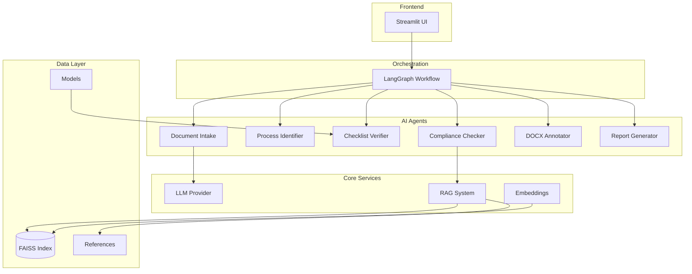

# 🏢 ADGM Corporate Agent

> **Enterprise-Grade AI Document Review System for ADGM Compliance**

An advanced AI assistant that automates the review of ADGM-related legal documents (.docx), detects target processes, verifies compliance against checklists, flags regulatory issues with citations using RAG, and generates comprehensive reports with actionable insights.

[](https://www.python.org/downloads/)
[](https://github.com/langchain-ai/langgraph)
[](https://streamlit.io/)
[](https://opensource.org/licenses/MIT)

## 🚀 Key Features

### 🤖 Multi-Agent Architecture

- **Intelligent Document Classification**: Keyword-based + LLM fallback classification
- **Process Detection**: Automatic identification of target processes (Company Incorporation, etc.)
- **Compliance Verification**: RAG-powered regulatory compliance checking with citations
- **Smart Annotations**: Contextual in-document comments with source references
- **Comprehensive Reporting**: Structured JSON reports with actionable insights

### 🔍 Advanced RAG System

- **FAISS Vector Database**: High-performance similarity search
- **Sentence-Transformers**: State-of-the-art embeddings
- **Provenance Tracking**: Full source attribution and citation management
- **Multi-Format Support**: TXT, PDF, DOCX document ingestion

### 🎯 Compliance & Governance

- **Checklist Verification**: Automated document completeness checking
- **Regulatory Citations**: Direct links to ADGM regulations and guidelines
- **Severity Classification**: High/Medium/Low issue prioritization
- **Groundedness Scoring**: Confidence metrics for AI-generated insights

### 🛠️ Enterprise-Ready Features

- **Provider Agnostic**: Support for Gemini, OpenAI, Anthropic, Ollama
- **Scalable Architecture**: LangGraph workflow orchestration
- **Modern UI**: Streamlit-based intuitive interface
- **Extensible Design**: Modular agent system for easy customization

## 🏗️ Architecture Overview



## 📁 Project Structure

```
ADGM/Corporate Agent/
├── 📂 app/                          # Core application code
│   ├── 🤖 agents/                   # AI agent implementations
│   │   ├── checklist_verifier.py    # Document completeness verification
│   │   ├── compliance_checker.py    # RAG-powered compliance analysis
│   │   ├── doc_intake.py           # Document parsing & classification
│   │   ├── docx_annotator.py       # In-document annotation system
│   │   ├── process_identifier.py   # Process detection logic
│   │   └── report_generator.py     # Structured report generation
│   ├── ⚙️ core/                     # Core system components
│   │   ├── config.py               # Environment & settings management
│   │   ├── embeddings.py           # Sentence-Transformers integration
│   │   └── llm.py                  # Multi-provider LLM abstraction
│   ├── 📊 models/                   # Data models & schemas
│   │   ├── checklists.json         # Process-specific document requirements
│   │   ├── doc_types.json          # Document classification labels
│   │   └── schemas.py              # Pydantic data models
│   ├── 🔧 services/                 # Business logic services
│   │   ├── rag_indexer.py          # FAISS index management
│   │   └── retriever.py            # Vector search & retrieval
│   ├── 🎨 ui/                       # User interface components
│   │   ├── streamlit_app.py        # Main application interface
│   │   ├── streamlit_components.py # Reusable UI components
│   │   └── streamlit_theme.py      # Custom styling
│   └── 🔄 workflows/                # Process orchestration
│       └── corporate_agent_graph.py # LangGraph workflow definition
├── 📂 data/                         # Application data
│   ├── faiss_index/                # Vector database files
│   ├── outputs/                    # Generated reports & documents
│   └── uploads/                    # User document uploads
├── 📂 references/                   # Knowledge base
│   ├── raw/                        # Original source documents
│   ├── sources.json                # Source metadata & URLs
│   └── *.txt                       # Processed text for indexing
├── 📂 scripts/                      # Utility scripts
│   ├── fetch_sources.py            # Source document retrieval
│   ├── ingest_refs.py              # Knowledge base indexing
│   └── generate_sample_docs.py     # Sample document generation
├── 📂 assets/                       # Static assets
├── 📄 requirements.txt              # Python dependencies
├── 📄 ENV.example                   # Environment template
└── 📄 README.md                     # This file
```

## 🚀 Quick Start

### Prerequisites

- **Python 3.11+**
- **Git**
- **Google API Key** (for Gemini LLM)

### 1. Installation

```bash
# Clone the repository
git clone <repository-url>
cd ADGM/Corporate\ Agent/

# Create virtual environment
python -m venv .venv

# Activate virtual environment
# Windows PowerShell:
.venv\Scripts\Activate.ps1
# Windows Command Prompt:
.venv\Scripts\activate.bat
# macOS/Linux:
source .venv/bin/activate

# Install dependencies
pip install -r requirements.txt
```

### 2. Configuration

```bash
# Copy environment template
cp ENV.example .env

# Edit .env with your settings
# Required: GOOGLE_API_KEY
# Optional: Customize paths, models, etc.
```

**Environment Variables:**

```env
# LLM Configuration
LLM_PROVIDER=gemini                    # gemini, openai, anthropic, ollama
LLM_MODEL=gemini-2.0-flash            # Model name
GOOGLE_API_KEY=your_api_key_here      # Required for Gemini

# Embeddings
EMBEDDING_MODEL=sentence-transformers/all-MiniLM-L6-v2

# Paths
FAISS_INDEX_DIR=data/faiss_index
REFERENCES_DIR=references
UPLOAD_DIR=data/uploads
OUTPUT_DIR=data/outputs

# Chunking
MAX_CHUNK_TOKENS=400
CHUNK_OVERLAP=80
```

### 3. Knowledge Base Setup

```bash
# Optional: Fetch official ADGM sources
python scripts/fetch_sources.py

# Required: Build FAISS index from references
python scripts/ingest_refs.py
```

### 4. Launch Application

```bash
# Start the Streamlit application
streamlit run app/ui/streamlit_app.py
```

The application will be available at `http://localhost:8501`

## 📖 Usage Guide

### 1. Document Upload

- Navigate to the **Upload** tab
- Drag & drop or select `.docx` files
- Supported: Articles of Association, Board Resolutions, Memorandums, etc.

### 2. Process Detection

- The system automatically detects the target process
- Optionally override in the sidebar if needed
- Supported processes: Company Incorporation, Amendments, etc.

### 3. Analysis & Review

- Click **"Analyze"** to start the review process
- Monitor progress in real-time
- Review results in the **Review** tab

### 4. Results & Downloads

- **Checklist Summary**: Document completeness overview
- **Issues Analysis**: Detailed compliance issues with citations
- **Download Reviewed Documents**: Annotated `.docx` files
- **Download JSON Report**: Structured analysis report

## 📊 Output Format

### JSON Report Structure

The system generates comprehensive JSON reports with the following structure:

```json
{
  "process": "Company Incorporation",
  "documents_uploaded": 3,
  "required_documents": 5,
  "missing_documents": [
    "Shareholder Resolution(s)",
    "Passport Copies/Emirates IDs",
    "Proof of Registered Address",
    "Register of Directors (if corporate shareholder)"
  ],
  "issues_found": [
    {
      "document": "Articles of Association of SampleCo LTD",
      "section": "2. Jurisdiction",
      "issue": "Incorrect Jurisdiction Clause",
      "severity": "High",
      "evidence": [
        {
          "ref_id": "adgm_sample.txt#chunk-0",
          "snippet": "ADGM Companies Regulations 2020, Article 6: The jurisdiction for companies incorporated in ADGM shall be the ADGM Courts, and disputes shall be governed under ADGM regulations unless otherwise specified in accordance with ADGM law.",
          "source_url": "adgm_sample.txt"
        }
      ],
      "suggestion": "Specify ADGM Courts as the jurisdiction.",
      "source_filename": "sample_articles_of_association.docx",
      "category": "Compliance",
      "groundedness": 1.0,
      "suggestion_long": "The clause should be amended to reflect that the jurisdiction for disputes shall be the ADGM Courts, as per ADGM Companies Regulations 2020, Article 6, unless otherwise specified in accordance with ADGM law. The current clause incorrectly defaults to the UAE Federal Courts, which is not the standard for ADGM-incorporated companies."
    }
  ],
  "generated_files": {
    "annotated_docx": "sample_articles_of_association_reviewed.docx, sample_board_resolution_reviewed.docx, sample_memorandum_of_association_reviewed.docx",
    "report_json": "8079e5bd-671f-4363-862f-c275f3b64b99.json"
  },
  "task_id": "8079e5bd-671f-4363-862f-c275f3b64b99",
  "checklist_items": [
    {
      "name": "Shareholder Resolution(s)",
      "rationale": "Resolutions from incorporating shareholders or existing shareholders (for amendments) are required to approve key decisions like incorporation, appointment of officers, adoption of articles, and authorization of individuals to act on behalf of the company.",
      "source_url": "N/A (derived from context)",
      "present": false
    }
  ],
  "process_confidence": null,
  "checklist_summary": "Company Incorporation: 3 of 5 required items are uploaded. Missing items: Shareholder Resolution(s), Passport Copies/Emirates IDs, Proof of Registered Address, and Register of Directors (if corporate shareholder).",
  "doc_summaries": {
    "sample_articles_of_association.docx": "This document outlines the Articles of Association for SampleCo LTD, detailing its incorporation as a limited company. While the company is incorporated, any legal disputes will fall under the jurisdiction of the UAE Federal Courts, indicating SampleCo LTD is likely operating within the UAE but governed by its own internal bylaws and meeting procedures."
  }
}
```

### Report Fields Explained

| Field                | Description                                             |
| -------------------- | ------------------------------------------------------- |
| `process`            | Detected target process (e.g., "Company Incorporation") |
| `documents_uploaded` | Number of documents provided                            |
| `required_documents` | Total required documents for the process                |
| `missing_documents`  | List of missing required documents                      |
| `issues_found`       | Array of compliance issues with detailed analysis       |
| `generated_files`    | Paths to output files                                   |
| `task_id`            | Unique identifier for the analysis task                 |
| `checklist_items`    | Detailed checklist with rationale and status            |
| `process_confidence` | Confidence score for process detection                  |
| `checklist_summary`  | Human-readable summary of checklist status              |
| `doc_summaries`      | Per-document summaries generated by LLM                 |

### Issue Analysis Structure

Each issue includes:

- **Document & Section**: Specific location of the issue
- **Severity**: High/Medium/Low priority classification
- **Evidence**: Supporting citations with source references
- **Suggestions**: Actionable recommendations
- **Groundedness**: Confidence score (0.0-1.0) for AI-generated insights

## 🔧 Configuration & Customization

### Adding New Document Types

1. **Update `app/models/doc_types.json`:**

```json
{
  "new_document_type": {
    "label": "New Document Type",
    "keywords": ["keyword1", "keyword2"],
    "exemplar": "Example text pattern"
  }
}
```

2. **Update `app/models/checklists.json`:**

```json
{
  "new_process": {
    "required_documents": [
      {
        "name": "New Document Type",
        "rationale": "Why this document is required",
        "source_url": "Reference URL"
      }
    ]
  }
}
```

### Extending LLM Providers

1. **Implement `LLMClient` interface in `app/core/llm.py`**
2. **Add provider configuration in `app/core/config.py`**
3. **Update environment variables**

### Customizing RAG System

- **Embedding Model**: Change `EMBEDDING_MODEL` in `.env`
- **Chunking Strategy**: Adjust `MAX_CHUNK_TOKENS` and `CHUNK_OVERLAP`
- **Index Rebuilding**: Run `python scripts/ingest_refs.py`

## 🛠️ Development

### Project Setup for Developers

```bash
# Install development dependencies
pip install -r requirements.txt

# Set up pre-commit hooks (if available)
pre-commit install

# Run tests
python -m pytest tests/

# Code formatting
black app/
isort app/

# Type checking
mypy app/
```

### Architecture Patterns

- **Agent Pattern**: Each agent has a single responsibility
- **Strategy Pattern**: LLM provider abstraction
- **Factory Pattern**: Document type classification
- **Observer Pattern**: LangGraph workflow state management

### Adding New Agents

1. **Create agent file in `app/agents/`**
2. **Implement required interface methods**
3. **Add to workflow in `app/workflows/corporate_agent_graph.py`**
4. **Update schemas in `app/models/schemas.py`**

## 📈 Performance & Scalability

### Current Performance Metrics

- **Document Processing**: ~30-60 seconds per document
- **RAG Retrieval**: <1 second per query
- **LLM Response**: 5-15 seconds per analysis
- **Memory Usage**: ~2-4GB for typical workloads

### Optimization Strategies

- **Caching**: Workflow state caching for repeated operations
- **Batch Processing**: Parallel document analysis
- **Index Optimization**: FAISS index tuning for specific use cases
- **Model Selection**: Configurable LLM models for speed vs. accuracy

## 🔒 Security & Compliance

### Data Privacy

- **Local Processing**: All analysis performed locally
- **No Data Retention**: Documents processed in-memory only
- **Secure Storage**: Environment variables for API keys

### Compliance Features

- **Audit Trail**: Full provenance tracking for all citations
- **Version Control**: Document version management
- **Access Control**: Configurable user permissions (future)

## 🐛 Troubleshooting

### Common Issues

| Issue                  | Solution                                                 |
| ---------------------- | -------------------------------------------------------- |
| FAISS index not found  | Run `python scripts/ingest_refs.py`                      |
| No citations generated | Ensure `references/` contains relevant documents         |
| LLM not responding     | Check API key and provider configuration                 |
| Memory errors          | Reduce `MAX_CHUNK_TOKENS` or use smaller embedding model |

### Debug Mode

```bash
# Enable debug logging
export LOG_LEVEL=DEBUG
streamlit run app/ui/streamlit_app.py
```

### Performance Tuning

```env
# For faster processing (lower quality)
LLM_MODEL=gemini-1.5-flash
EMBEDDING_MODEL=sentence-transformers/all-MiniLM-L6-v2
MAX_CHUNK_TOKENS=200

# For higher quality (slower processing)
LLM_MODEL=gemini-2.0-flash-exp
EMBEDDING_MODEL=sentence-transformers/all-mpnet-base-v2
MAX_CHUNK_TOKENS=800
```

## 📚 API Reference

### Core Classes

#### `AnalysisReport`

Main output schema containing all analysis results.

#### `IssueItem`

Individual compliance issue with evidence and suggestions.

#### `ChecklistItem`

Required document with rationale and presence status.

### Key Methods

#### `get_llm_client()`

Returns configured LLM client based on environment settings.

#### `build_faiss_index()`

Creates FAISS index from reference documents with provenance.

#### `analyze_documents()`

Main entry point for document analysis workflow.

## 🤝 Contributing

1. **Fork the repository**
2. **Create feature branch**: `git checkout -b feature/amazing-feature`
3. **Commit changes**: `git commit -m 'Add amazing feature'`
4. **Push to branch**: `git push origin feature/amazing-feature`
5. **Open Pull Request**

### Development Guidelines

- Follow PEP 8 style guidelines
- Add type hints to all functions
- Include docstrings for public methods
- Write tests for new features
- Update documentation for API changes

## 📄 License

This project is licensed under the MIT License - see the [LICENSE](LICENSE) file for details.

## 🙏 Acknowledgments

- **ADGM**: Abu Dhabi Global Market for regulatory guidance
- **LangChain**: LangGraph workflow orchestration
- **Streamlit**: Modern web application framework
- **FAISS**: High-performance similarity search
- **Sentence-Transformers**: State-of-the-art embeddings

## 📞 Support

- **Documentation**: [Project Wiki](link-to-wiki)
- **Issues**: [GitHub Issues](link-to-issues)
- **Discussions**: [GitHub Discussions](link-to-discussions)
- **Email**: support@adgm-corporate-agent.com

---

**Built with ❤️ for ADGM compliance automation**
