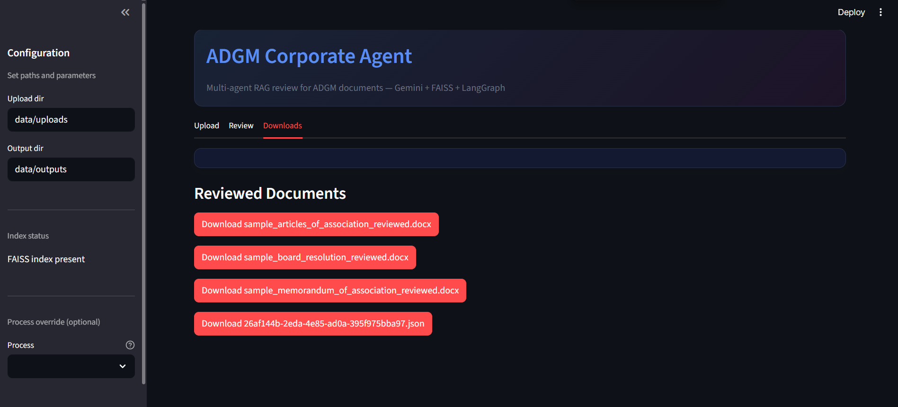

# ADGM Corporate Agent (Multi-Agent RAG, LangGraph, LLM Provider, FAISS)

An AI assistant that reviews ADGM-related legal documents (.docx), detects the target process (e.g., Company Incorporation), verifies uploaded documents against checklists, flags red flags with citations using RAG, inserts contextual in-document comments, and outputs a reviewed .docx plus a structured JSON report.

## Architecture

- Orchestration: LangGraph workflow (`app/workflows/corporate_agent_graph.py`)
- LLM: Provider abstraction (`app/core/llm.py`) — Gemini supported; extensible to OpenAI/Anthropic/Ollama
- RAG: Sentence-Transformers embeddings + FAISS (`app/core/embeddings.py`, `app/services/rag_indexer.py`, `app/services/retriever.py`)
- Agents:
  - Intake/classification (`app/agents/doc_intake.py`)
  - Process detection (`app/agents/process_identifier.py`)
  - Checklist verification (`app/agents/checklist_verifier.py`)
  - Compliance checker (LLM+RAG) (`app/agents/compliance_checker.py`)
  - DOCX annotator (`app/agents/docx_annotator.py`)
  - Report generator (`app/agents/report_generator.py`)
- UI: Streamlit (`app/ui/streamlit_app.py`)

## Project Structure

```
ADGM/
  └─ Corporate Agent/
     ├─ app/
     │  ├─ agents/
     │  │  ├─ checklist_verifier.py       # Loads JSON checklist, computes missing items
     │  │  ├─ compliance_checker.py       # LLM+RAG compliance issues with citations/suggestions
     │  │  ├─ doc_intake.py               # .docx parsing and doc-type classification (LLM fallback)
     │  │  ├─ docx_annotator.py           # Inline notes + Issues section in reviewed .docx
     │  │  ├─ process_identifier.py       # Detect target process (e.g., Company Incorporation)
     │  │  └─ report_generator.py         # Build Pydantic analysis report
     │  ├─ core/
     │  │  ├─ config.py                   # Env/settings
     │  │  ├─ embeddings.py               # Sentence-Transformers model
     │  │  └─ llm.py                      # Provider abstraction (Gemini; extensible)
     │  ├─ models/
     │  │  ├─ checklists.json             # Externalized required documents w/ rationale + source
     │  │  ├─ doc_types.json              # Labels and exemplar hints for classification
     │  │  └─ schemas.py                  # Pydantic models
     │  ├─ services/
     │  │  ├─ rag_indexer.py              # Build FAISS from references; stores provenance in meta
     │  │  └─ retriever.py                # FAISS search returning chunk + title/source_url
     │  ├─ ui/
     │  │  ├─ streamlit_app.py            # App layout (Upload/Review/Downloads)
     │  │  ├─ streamlit_components.py     # Checklist banner/cards, issues table, downloads
     │  │  └─ streamlit_theme.py          # CSS theme
     │  └─ workflows/
     │     └─ corporate_agent_graph.py    # LangGraph pipeline orchestration
     ├─ data/
     │  ├─ faiss_index/                   # index.faiss, chunks.json, meta.json
     │  ├─ outputs/                       # Reviewed .docx and report JSONs
     │  └─ uploads/                       # User uploads / sample docs
     ├─ references/
     │  ├─ raw/                           # Downloaded originals (html/pdf/docx)
     │  ├─ sources.json                   # Official ADGM links used for provenance mapping
     │  └─ *.txt                          # Extracted text for indexing
     ├─ scripts/
     │  ├─ fetch_sources.py               # Pull official pages/templates → raw/ and .txt
     │  ├─ ingest_refs.py                 # Build FAISS index with provenance
     │  └─ generate_sample_docs.py        # Create example .docx files in data/uploads
     ├─ ENV.example
     └─ README.md
```

### Pipeline (end-to-end)


1. Intake reads text from `.docx` and classifies document type (keywords; falls back to zero-shot LLM using `app/models/doc_types.json`).
2. Process is detected from the set of doc types (or can be overridden in the UI).
3. Checklist verification compares uploaded types with `app/models/checklists.json` and identifies missing items, reasons, and sources.
4. Compliance checker runs LLM with retrieved ADGM context (from FAISS) to produce issues with severity, suggestions, and citations.
5. Annotator highlights relevant paragraphs and inserts concise inline notes with short citations (e.g., “Per ADGM Companies Regulations 2020, Art. 6”). Full details appear in an Issues section.
6. Outputs include the reviewed `.docx` and a JSON report with checklist, issues, and output filenames.

## Setup

1. Python 3.11+
2. Create a virtual environment and install deps

```
python -m venv .venv
. .venv/Scripts/activate  # Windows PowerShell: .venv\Scripts\Activate.ps1
pip install -r requirements.txt
```

3. Configure environment
   Copy `ENV.example` → `.env` and fill values as needed:

- LLM provider & model: `LLM_PROVIDER=gemini`, `LLM_MODEL=gemini-2.0-flash`
- Keys: `GOOGLE_API_KEY` (for Gemini). Future: `OPENAI_API_KEY`, `ANTHROPIC_API_KEY`, `OLLAMA_HOST`
- Embeddings: `EMBEDDING_MODEL` (defaults to `sentence-transformers/all-MiniLM-L6-v2`)
- Paths: `FAISS_INDEX_DIR`, `REFERENCES_DIR`, `UPLOAD_DIR`, `OUTPUT_DIR`
- Chunking: `MAX_CHUNK_TOKENS`, `CHUNK_OVERLAP`

4. Ingest references (with provenance)

- Optional: fetch official ADGM sources into `references/raw` and extract text

```
python scripts/fetch_sources.py
```

- Build (or rebuild) FAISS index from `references/` (txt/pdf/docx). This writes `index.faiss`, `chunks.json`, `meta.json` (with `title` and `source_url` for citations):

```
python scripts/ingest_refs.py
```

5. Run the app

```
streamlit run app/ui/streamlit_app.py
```

## Using the App

1. Upload one or more `.docx` files
2. Optionally set “Process override” in the sidebar if auto-detection may be wrong
3. Click “Analyze”
4. Review tab shows:
   - Checklist banner with uploaded/required counts and missing items
   - Expandable checklist details with rationale and source links
   - Issues list (severity, issue text, suggestions, citations)
5. Downloads tab offers reviewed `.docx` and JSON report

Tip: Use `scripts/generate_sample_docs.py` to create example inputs in `data/uploads/`.

## Configuration Reference

- LLM provider & model: `LLM_PROVIDER`, `LLM_MODEL`
- Provider keys: `GOOGLE_API_KEY` (Gemini); placeholders for `OPENAI_API_KEY`, `ANTHROPIC_API_KEY`, `OLLAMA_HOST`
- Embeddings: `EMBEDDING_MODEL`
- Paths: `FAISS_INDEX_DIR`, `REFERENCES_DIR`, `UPLOAD_DIR`, `OUTPUT_DIR`
- Chunking: `MAX_CHUNK_TOKENS`, `CHUNK_OVERLAP`

## Checklists & Document Types

- `app/models/checklists.json`: per-process required documents with `name`, `rationale`, `source_url`
- `app/models/doc_types.json`: labels and exemplar hints for classification
- Extend/modify these JSON files to cover additional ADGM processes and templates

## Developer Notes

- LLM adapter: `app/core/llm.py` implements a unified interface; currently includes a Gemini client. Add other providers by implementing `LLMClient` and wiring `get_llm_client()`.
- Workflow state caches intake text to avoid repeated parsing.
- Annotator groups multiple issues per paragraph into a single concise inline comment; unmatched items go to an “Unanchored Comments” section.
- Real Word comments (Review pane): the annotator inserts true OOXML comments and a concise inline note for visibility. Paragraph selection is LLM-guided with heuristic/semantic fallback. Phrase-span anchoring is scaffolded and can be extended to exact run ranges if needed.
- Provenance: retriever returns `title` and `source_url`; UI and .docx include source links.

## Troubleshooting

- “FAISS index not found. Run scripts/ingest_refs.py first.” → Ingest references.
- No citations or poor matches → Ensure `references/` contains relevant ADGM .txt/.pdf/.docx and re-run ingestion.
- LLM not used (heuristics only) → Set `LLM_PROVIDER`/`LLM_MODEL` and the corresponding API key; restart app.
- Windows venv activation (PowerShell): `.venv\Scripts\Activate.ps1`.

## Output

**Where to find artifacts in this repo:**

- **GitHub/Zipped codebase**: This repository directory (`ADGM/Corporate Agent/`). You can zip it from the repo root.
- **Example input documents** (before review): `data/uploads/`
  - e.g., `data/uploads/sample_articles_of_association.docx`, `data/uploads/sample_board_resolution.docx`, `data/uploads/sample_memorandum_of_association.docx`
- **Reviewed documents** (after review): `data/outputs/`
  - e.g., `data/outputs/sample_articles_of_association_reviewed.docx`
- **Structured output report** (JSON): `data/outputs/<task_id>.json`
  - The JSON includes: detected process, uploaded/required counts, missing documents, issues (severity, suggestions, citations), generated filenames, optional process confidence, and per-document summaries.

### Screenshots / Demo Video

- Uploads: 
- Review: 
- Summary: 
- Downloads: 
- Demo video: end-to-end walkthrough — [YouTube](https://youtu.be/8yImoXR274s)
- Demo video: end-to-end walkthrough — [YouTube](assets/ADGM-Corporate-Agent-Demo.mp4)

## Output

- Reviewed `.docx` written to `data/outputs/`
- JSON report saved to `data/outputs/` and downloadable via UI
- Report includes: detected process, uploaded/required counts, missing documents, issues (severity, suggestions, citations), and generated file names
- Report now also includes: `process_confidence`, LLM-generated `checklist_summary`, and per-document `doc_summaries`.
